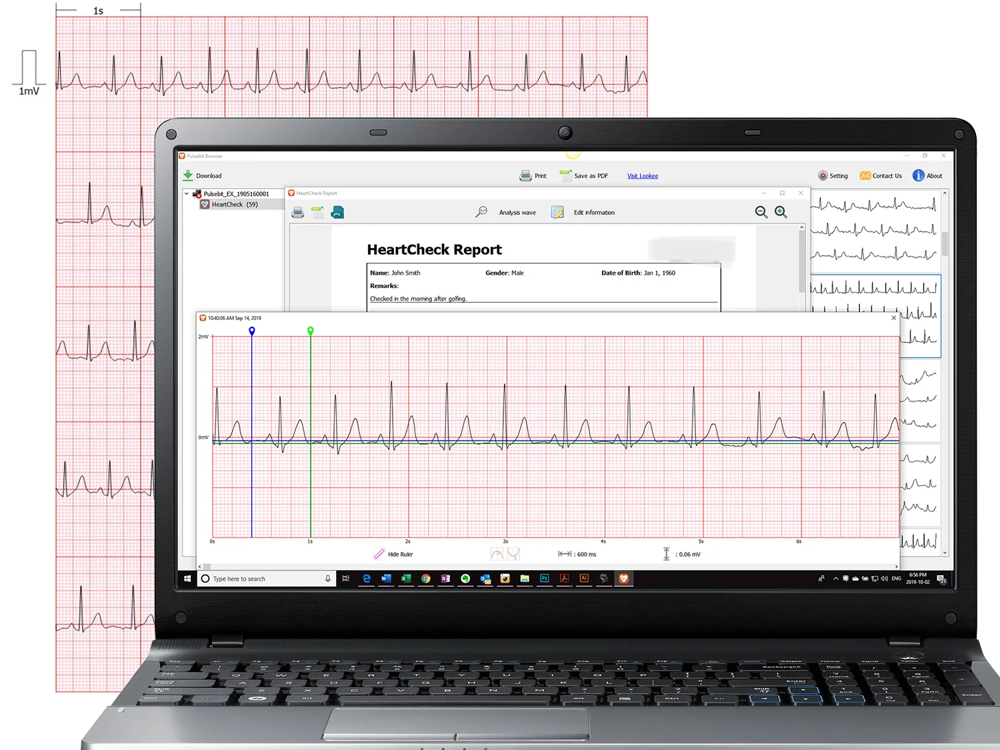

  <a href="https://www.lookeetech.com/cdn/shop/products/Lookee-EKG-ECG-Heart-Health-Tracker-Monitor-2_1800x1800.jpg?v=1585200915">

    
    
    
    
    

**ECG Monitor** is [ITR VN](https://itrvn.com/)'s next generation product designed to provide advanced health monitoring solutions by accurately measuring and analyzing heart activity. This innovative device ensures precise and reliable ECG readings, making it an essential tool for personal health management and medical diagnostics.

## Learn More about Smart Desk Clock 
 

  <a href="https://www.lookeetech.com/cdn/shop/products/Lookee-EKG-ECG-Heart-Health-Tracker-Monitor-PC-App_1800x1800.jpg?v=1585200915">

## Table of Contents
- [Learn More about Smart Desk Clock](#learn-more-about-smart-desk-clock)
- [Table of Contents](#table-of-contents)
- [Technologies](#technologies)
- [Features](#features)
- [Usage](#usage)
- [Contributing](#contributing)
- [License](#license)
- [Demo ECG monitor](#demo-ecg-monitor)

## Technologies
 

  

* **STM32 Microcontroller**: The project is based on the STM32 microcontroller platform, which offers a wide range of microcontrollers with different performance levels and features.
*  **STM32CubeIDE**: The project was developed using popular IDEs which is STM32CubeIDE, provide tools for code development, debugging, and firmware deployment.
*  **Communication Protocols**: The project includes the implementation of communication protocols such as UART, I2C, SPI, and wireless protocols like BLE .
*  **Peripheral Libraries**: The project utilizes peripheral libraries provided by the microcontroller manufacturer or third-party libraries to simplify the integration and configuration of peripherals.
*  **Other Device**: We intergrated a lot of device to increase experiment of customer and performance of device .
*  See our [document](./feature_of_project.md), [system architecture](./firmware_layer_interact.pu) and **system design** for more details .

## Features

**ECG Monitor** offers a wide range of features designed to provide comprehensive and reliable heart monitoring solutions such as:

1. **ECG Reading + Digital Filtering:**
  - Utilizes advanced sensors and digital filtering to deliver precise and consistent electrocardiogram readings.

2. **Pulse Output to GUI:**
  - Displays real-time ECG waveforms on a graphical user interface for easy monitoring and analysis.

3. **Heart Rate Measurement:**
  - Accurately measures and displays the heart rate based on ECG data.

4. **Alerts for High or Low Heart Rate:**
  - Provides alerts through LED indicators and a buzzer if the heart rate exceeds or falls below set thresholds.

## Usage
1. Clone the project repository from [GitHub ↗](https://github.com/vyluu-itr/06-2024-itr-intern-group-2).
2. Set up your development environment with the required IDE (STM32CubeIDE) and toolchain and open the project in the chosen IDE.
3. Read our **diagram**<!--[diagram](./doc/pic/.png)--> to connect the necessary peripherals or sensors to the STM32 microcontroller.
4. Deploy the firmware to the STM32 microcontroller using the appropriate flashing method (e.g., ST-Link, DFU, or bootloader).

## Contributing
We welcome contributions to this project! To ensure a smooth contribution process, please follow the guidelines below:

1. Make sure you have read and understood the Contribution Guide before getting started.
2. Check the Issues to see if there are any existing issues or requested features.
3. Create a new branch from main to work on your new feature: git checkout -b new-feature.
4. Make the necessary changes, additions, or bug fixes in the source code.
5. Double-check the code to ensure there are no errors and that it follows the coding guidelines.
6. Create a Pull Request with a detailed description of the changes you have made.
7. Wait for feedback and make any requested changes from the code reviewer.
8. Once your Pull Request is approved, thank you for your contribution and support!
* **Note**: Contributions to this project are welcome. If you find any issues or have suggestions for improvements, please submit a pull request or open an issue on the project's [GitHub repository](https://github.com/vyluu-itr/06-2024-itr-intern-group-2) or contact us [ITR VN](https://itrvn.com/).

## License
This project is licensed under the [ISO/VyLuu License](https://github.com/vyluu-itr). Please see the LICENSE file for more details.

## Demo ECG monitor
Below are a few typical features of ECG monitor:

**Link Demo**
<!-- [Link Demo](https://www.youtube.com/watch?v=Lgt1foWSNBM) -->